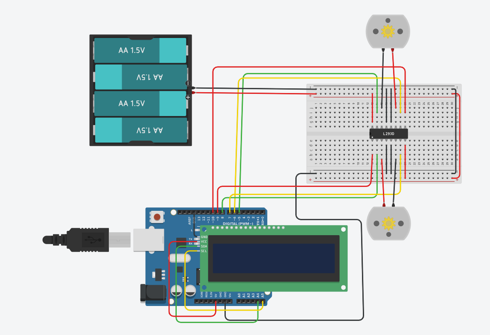

# Programming two DC motors
[simulation](https://www.tinkercad.com/things/7LKJLGIL0C9-programming-two-dc-motors)
### - Program two DC motors using the L298N motor driver to perform the following movements:
   1. Forward for 30 seconds
   2. Backward for 1 minute
   3. Alternate left and right for 1 minute
- After programming the motors, connect the Arduino to the LCD so that the name of the movement appears on the screen in conjunction with the motor movement. Use one of the communication protocols.

for that we need
| Name  | Quantity | Component |
|-------|-----------|------------|
| M1 M4 | 2 | DC Motor |
| U1 | 1 | H-bridge Motor Driver |
| U2 | 1 | Arduino Uno R3 |
| U4 | 1 | PCF8574-based, 39 (0x27) LCD 16 x 2 (I2C) |
| Bat4 | 1 | 4 batteries, AA, no 1.5V Battery |

<ins> There are other ways but this is what worked for me.</ins>

Four AA batteries (1.5V each) are used to provide sufficient power (6V) for the DC motors.
(This battery is the good size for the circuit)
The batteries are connected to the breadboard power rails, where the red wire is positive (+) and the black wire is ground (−).

The L293D (I did not find L298N ) chip is placed in the middle of the breadboard and acts as an H-Bridge motor driver to control two DC motors.

Control pins from the Arduino are connected to the input pins of the L293D to control motor direction and speed.

Each motor is connected to one side of the chip outputs.

The Arduino Uno sends control signals to the L293D through its digital (PWM) pins.

An LCD display (with I2C interface) is connected to the Arduino using SDA and SCL lines to show information such as motor status or direction.

Wire color meanings:

Red = Power (VCC)

Black = Ground (GND)

Yellow/Green = Control signals between Arduino, L293D, and LCD

The purpose of this setup is to control the rotation, direction, and speed of two DC motors using Arduino while displaying relevant information on the LCD.

[The code](_programming_two_dc_motors1.ino)
